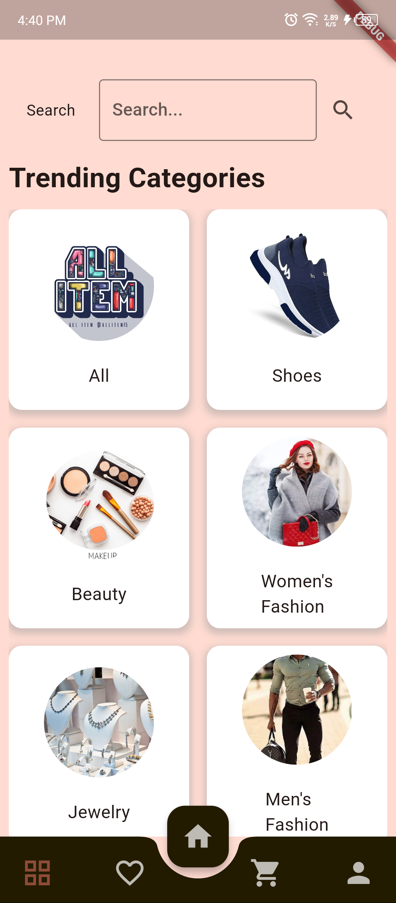
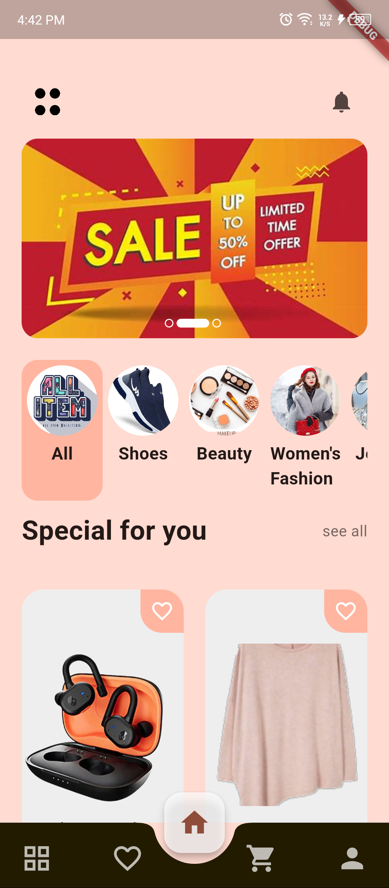
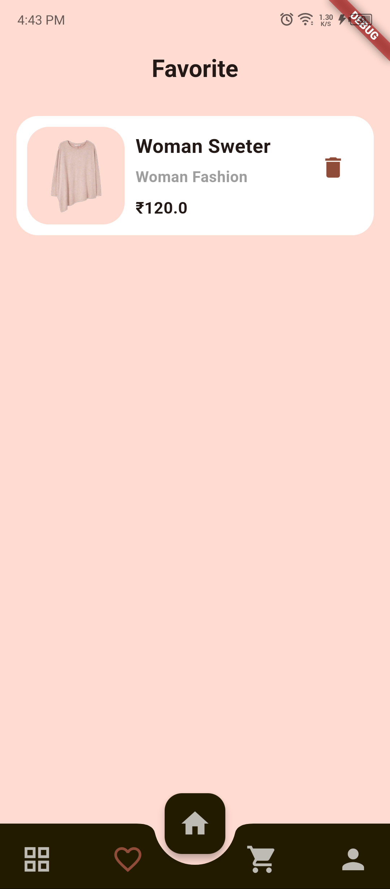
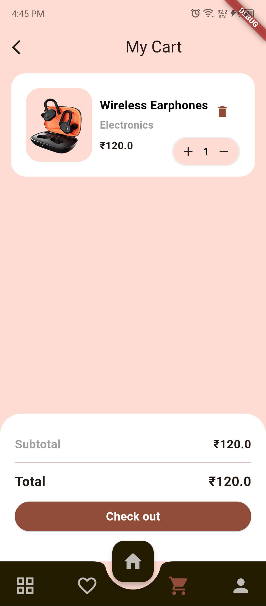
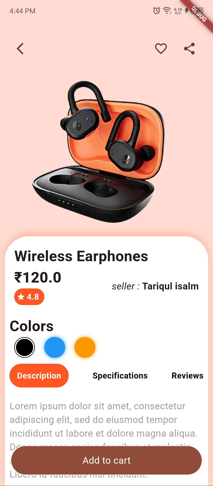
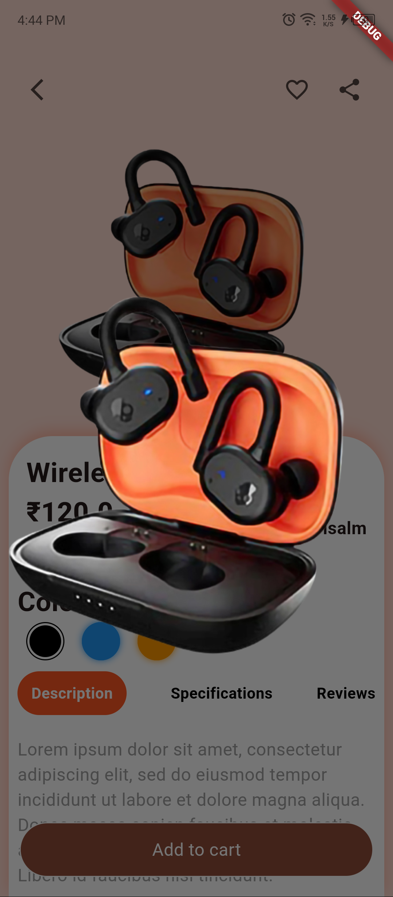

# ecommerce_app

## About the ecommerce_app

E-Commerce App 
• Designing and implementing a real-time e-commerce application with separate buyer and seller options.
• Almost completed the UI design using Flutter, ensuring a responsive and user-friendly interface.
• Integrating Firebase for backend services including authentication, Firestore for real-time database, and cloud functions.
• Features planned include product listing, cart management, order tracking, and user reviews.

##Screenshots

<table>
  <tr>
    <td></td>
    <td></td>
    <td></td>
    <td></td>
</tr>
<tr>
    <td></td>
    <td></td>
  </tr>
</table>